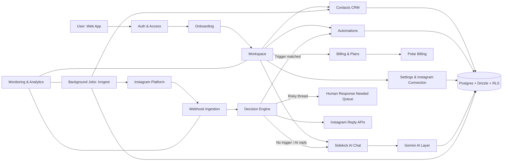

<p align="center">
  <a href="https://pilot-ops.vercel.app" rel="noopener">
    
  </a>
</p>

<h3 align="center">Pilot — Turn Instagram DMs Into Qualified Leads</h3>

<div align="center">

[]()
[](https://github.com/getpilot/app/issues)
[](https://github.com/getpilot/app/pulls)
[](./LICENSE)
[](https://www.react.doctor/share?p=pilot&s=83&e=4&w=175&f=74)

</div>

---

<p align="center">
  AI-powered Instagram sales system for lead management and revenue operations - built for creators, entrepreneurs, and social teams who want conversions, not brittle flow-builder bots.
</p>

## Table of Contents

- [About](#about)
- [Pilot vs ManyChat](#pilot-vs-manychat)
- [Architecture](#architecture)
- [Monorepo Setup](#monorepo-setup)
- [Turborepo Commands](#turborepo-commands)
- [Roadmap](#roadmap)
- [Documentation](#documentation)
- [Contributing](#contributing)
- [License](#license)
- [Authors](#authors)
- [Acknowledgements](#acknowledgements)

## About

Pilot is an Instagram automation and deal management platform designed to help creators, entrepreneurs, small businesses, and social media managers turn Instagram conversations into qualified pipeline.

Pilot is positioned as a **sales system, not a bot**:

- Intent-aware conversation handling over rigid decision trees
- CRM depth (lead score, stage, sentiment, tags, notes, follow-up context)
- Human Response Needed (HRN) guardrails for risky threads
- Open source and self-hostable for data and platform control

The AI-powered Sidekick supports lead qualification, response generation, and next-step recommendations while preserving human oversight where needed.

## Pilot vs ManyChat

### Common ManyChat pain points

- Unreliable follow-to-DM behavior and delayed sends
- Shadow-ban/account-risk anxiety from aggressive automation patterns
- Per-contact pricing shock as contact count scales
- Flow-builder complexity for simple use cases

### Head-to-head comparison

| Dimension | ManyChat | Pilot | Advantage |
|-----------|----------|-------|-----------|
| **AI Intelligence** | Basic rule-based flows + AI add-on ($) | Native AI-first with intent detection, sentiment analysis, lead scoring | **Pilot** |
| **Conversation Handling** | One reply per trigger pattern | Sidekick tracks conversation context and tone | **Pilot** |
| **Lead Management** | Basic contact list | Full contact CRM with scoring, tags, stages, sentiment | **Pilot** |
| **Human Handoff** | Mostly manual | HRN system with classifier + risk heuristics | **Pilot** |
| **Pricing Model** | Per-contact scaling | Open-source, self-hostable, predictable model direction | **Pilot** |
| **Shadow Ban Protection** | Manual mitigation | Guardrails-first automation design | **Pilot** |
| **Setup Complexity** | Visual flow builder | Trigger + AI handling | **Pilot** |
| **Open Source** | Closed, vendor lock-in | Fully open-source and forkable | **Pilot** |
| **Multi-Step Sequences** | Supported | Not yet built | **ManyChat** |
| **Visual Flow Builder** | Supported | Not yet built | **ManyChat** |
| **Multi-Channel** | Instagram + FB + WhatsApp + SMS | Instagram-first today | **ManyChat** |
| **Integrations** | 50+ integrations | Early-stage integration surface | **ManyChat** |

Full competitive breakdown: [competitive-analysis.md](./competitive-analysis.md)

## Architecture



## Monorepo Setup

This repository uses **pnpm workspaces** + **Turborepo**.

### Structure

- `apps/app` -> Main product app
- `apps/web` -> Marketing website
- `packages/ui` -> Shared shadcn UI + Tailwind layer
- `packages/db` -> Shared Drizzle schema/client/migrations
- `packages/instagram` -> Shared Instagram Graph API client, token refresh, retries, webhook helpers
- `packages/core` -> Shared product brain (automation logic, sidekick logic, contact workflows)
- `packages/config` -> Shared eslint/postcss/tsconfig
- `packages/types` -> Shared domain types

### Install

```bash
pnpm install
```

### App-specific docs

- Main product app: [apps/app/README.md](./apps/app/README.md)
- Marketing app: [apps/web/README.md](./apps/web/README.md)

## Turborepo Commands

Run from repo root:

```bash
# run both apps/dev tasks via turbo graph
pnpm dev

# targeted dev
pnpm dev:app
pnpm dev:web

# run builds with turbo graph + cache
pnpm build

# targeted builds
pnpm build:app
pnpm build:web

# changed-only graph build
pnpm build:affected

# type checks
pnpm check-types
```

Turbo local cache is stored in `.turbo/`.

For remote cache in CI/team machines, set:

```bash
TURBO_TEAM=...
TURBO_TOKEN=...
```

## Roadmap

Roadmap is tracked in [ROADMAP.md](./ROADMAP.md).

## Documentation

- Product strategy and comparison: [competitive-analysis.md](./competitive-analysis.md)
- Engineering and contribution workflows: [CONTRIBUTING.md](./CONTRIBUTING.md)

## Contributing

All code setup, development workflow, testing, and deployment notes live in [CONTRIBUTING.md](./CONTRIBUTING.md).

## License

This project is licensed under the GNU Affero General Public License v3.0.

See [LICENSE](./LICENSE) for the full text.

## Authors

- **ArjunCodess** - Project development and maintenance

## Acknowledgements

- **Instagram** for providing the API that powers social integrations
- **Vercel** for the deployment platform and AI SDK
- **Neon** for serverless PostgreSQL hosting
- **shadcn/ui** and **Radix UI** for accessible UI components
- **Drizzle Team** for the ORM toolkit
- **Open Source Community** for the ecosystem of libraries and tools

---

<div align="center">

**Pilot** - Transforming Instagram interactions into business opportunities

</div>
